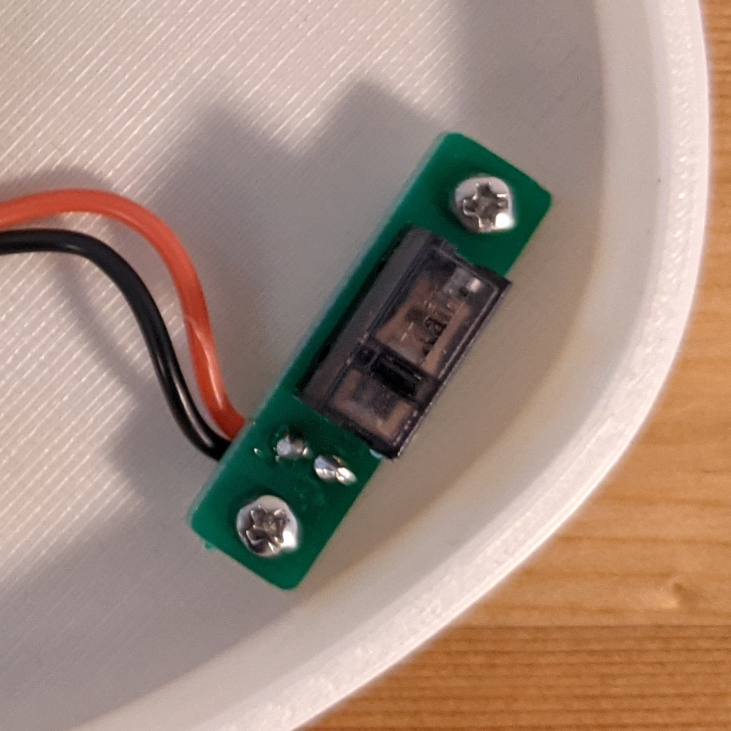
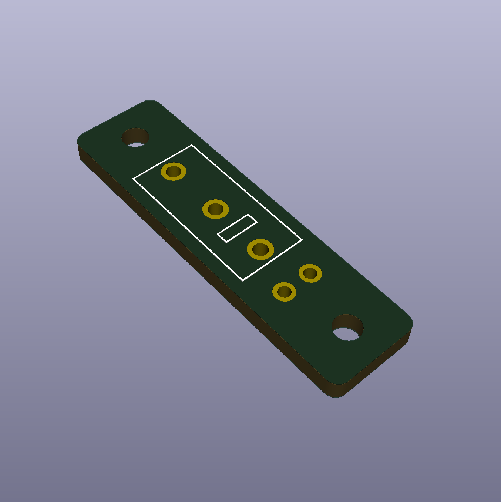

# Mouse switch mount PCB

This repository contains design files for a small PCB that can be used to attach mouse button switches like Omron D2F or Kailh GM to a case using M2 screws.

The Gerber zip file can be used to order the board from JLCPCB (and probably many other places).

